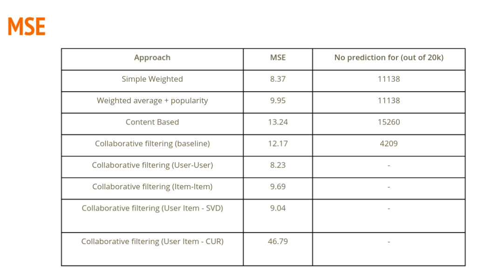
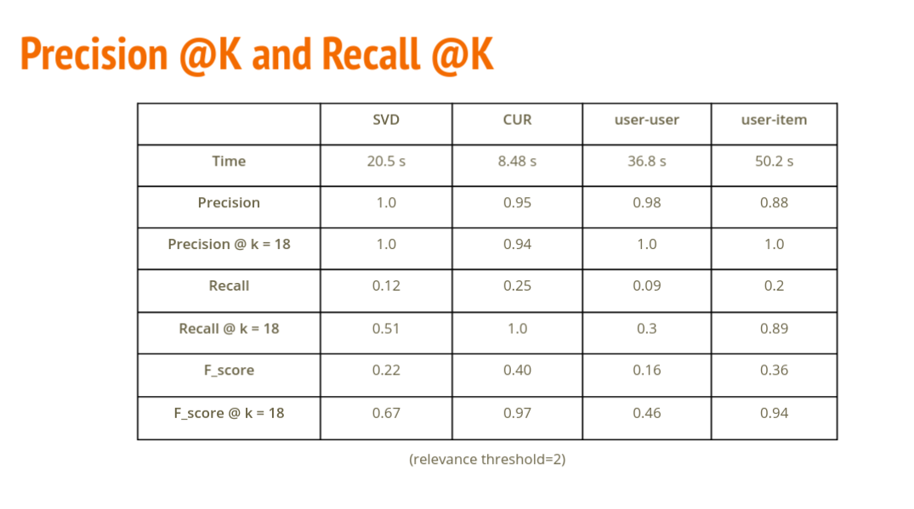
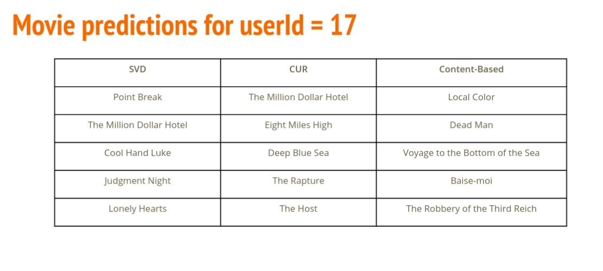

## Overview
In this project, we compare different approaches of the recommendation system. We have done a comparative study on an ensemble of MovieLens dataset and TMDB dataset. Based on all our observations we conclude that CUR decomposition performs best among other recommendation systems.

## Approahces


#### Baseline
- [x] Content based
  - [x] The rating for a new movies is the the average rating given by a user on all rated movies.
- [x]  Collaborative
  - [x]  The rating for a new movie is the average of the ratings for a movie by all users who rated that movie.
- [x] Simple Weighted
- [x] Weighted average + popularity
- [x] Content based
- [x] Collaborative filtering (User-User Based)
- [x] Collaborative filtering (Item-Item Based)
- [x] Collaborative filtering (SVD)
- [x] Collaborative filtering (CUR)

## Evaluation
- [x] MSE
- [x] Recall @K
- [x] Precision @K
- [x] F score @K
- [x] Time of prediction







## Usage
- Direct to the project directory.
- run ```make```
- execute ```./shell```
